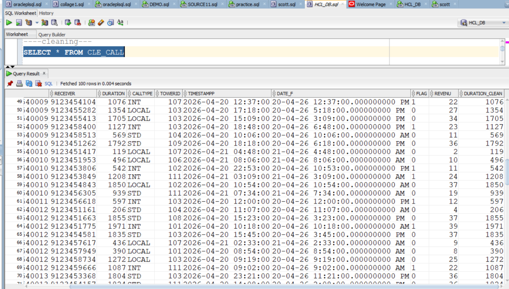
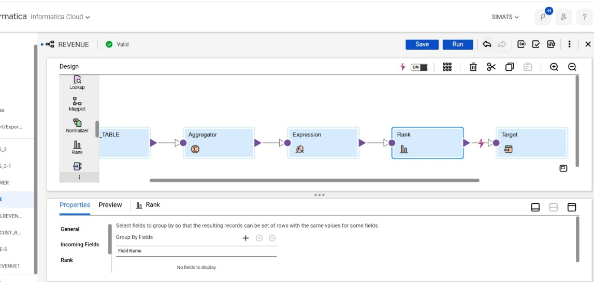

# Telecom CDR Analytics ETL Project

End-to-end telecom Call Detail Record (CDR) analytics pipeline using a dimensional model, Informatica IICS mappings, and KPI-driven reporting dashboards.

## Project Objective

Build a production-style ETL and analytics solution that:

- Ingests and cleanses telecom CDR data
- Loads a Star Schema (Fact + Dimensions)
- Implements SCD Type 2 logic for historical tracking
- Generates business KPIs for operations and revenue monitoring

## Repository Structure

```text
project1/
|-- SQL_Scripts/
|-- IICS_Mappings_and_Workflows/
|-- Architecture_Diagrams/
|-- BI_Dashboards/
|-- Document_Extracted_Assets/
`-- README.md
```

## Technology Stack

- **ETL:** Informatica Intelligent Cloud Services (IICS)
- **Data Modeling:** Star Schema (Fact/Dimension)
- **Database:** Relational warehouse target
- **Reporting:** BI dashboards (charts and KPI views)

## Data Model (Star Schema)

Core model includes:

- `FACT_CALL`
- `DIM_CUSTOMER`
- `DIM_TIME`
- `DIM_TOWER`
- `DIM_CALL_TYPE`

### Physical Data Model

The diagrams from your project document were extracted and organized. Highlight image:



## ETL Workflow (IICS)

Pipeline stages:

1. **Source ingestion** of CDR records
2. **Standardization and cleansing**
3. **Dimension loading** with surrogate keys
4. **SCD Type 2 processing** for historical changes
5. **Fact table loading** and KPI-ready outputs

### SCD Type 2 Mapping Logic (Router + Expression + Insert/Update)


### Mapping / Workflow Overview


## KPI Implementation

Key KPIs produced by SQL and ETL outputs:

- Daily Call Volume
- Revenue by customer/call type/time window
- International Call Monitoring
- Additional operational alerts/notifications

Implemented SQL scripts:

- `SQL_Scripts/01_create_star_schema.sql`
- `SQL_Scripts/02_scd2_dim_customer_logic.sql`
- `SQL_Scripts/03_kpi_queries.sql`

## Dashboard Outputs

### Daily Call Volume


### Revenue Analysis


### International Call Monitoring



### KPI Dashboard Overview


## Current Workspace Notes

This repository now includes:

- Extracted content from your project document (`Document_Extracted_Assets`)
- Split visual assets into architecture, mapping/workflow, and dashboard folders
- SQL scripts for star schema DDL, SCD Type 2 logic, and KPIs

## How to Run / Validate

1. Deploy or import mappings/workflows into IICS
2. Execute staging -> dimensions -> fact load sequence
3. Run KPI SQL queries
4. Validate dashboard values against SQL output

## Recruiter Highlights

- Enterprise-style folder organization
- Dimensional modeling with clear PK/FK design
- SCD Type 2 history handling in ETL
- KPI-to-dashboard traceability from source to insight
