# Telecom CDR Analytics and Cloud Integration ETL Project

An end-to-end Data Engineering pipeline that transforms raw Telecom Call Detail Records (CDR) into actionable business insights. This project demonstrates complex ETL workflows, including Data Cleansing, SCD Type 2 history tracking, and Star Schema modeling on a cloud-integrated platform.

## Project Flow (Document Order)

1. Physical Data Modelling
2. End-to-End Workflow
3. Staging Raw Tables
4. Cleansing
5. Dimension Tables
6. Fact Table
7. SCD Type 2 (Critical Logic)
8. KPI Mapping and Results
9. Final Reports / Dashboards

## 1) Physical Data Modelling

### What I implemented
- Designed a Star Schema for telecom analytics.
- Separated business attributes into dimensions and transactional metrics into fact.
- Defined PK/FK relationships for high-performance KPI queries.

### Core tables
- Dimensions: `DIM_CUSTOMER`, `DIM_TIME`, `DIM_TOWER`, `DIM_CALL_TYPE`
- Fact: `FACT_CALL`

### Architecture images
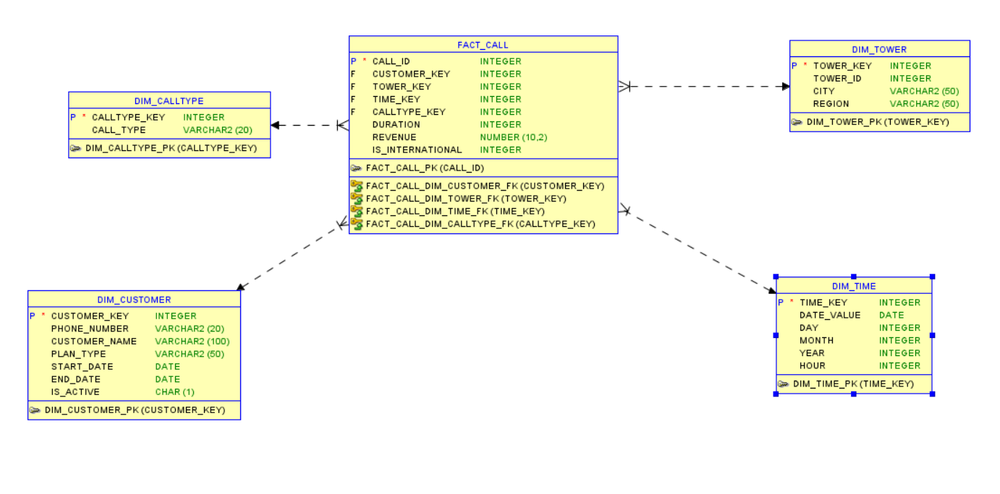

## 2) Workflow 

### End-to-end workflow
- Source raw CDR ingestion
- Data cleansing and standardization
- Staging and key preparation
- Dimension + Fact load
- KPI query generation
- Dashboard reporting

## 3) Staging Raw Tables

### What I implemented
- Created raw landing table for source data (`RAW_CDR`).
- Created typed staging table (`STG_CDR_CLEAN`) for cleansed records.
- Prepared data for dimensional model loading.

### SQL
- `SQL_Scripts/00_raw_and_staging_tables.sql`

### Images
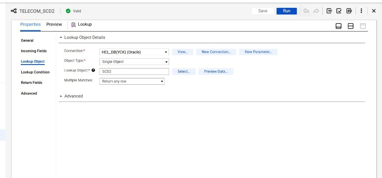
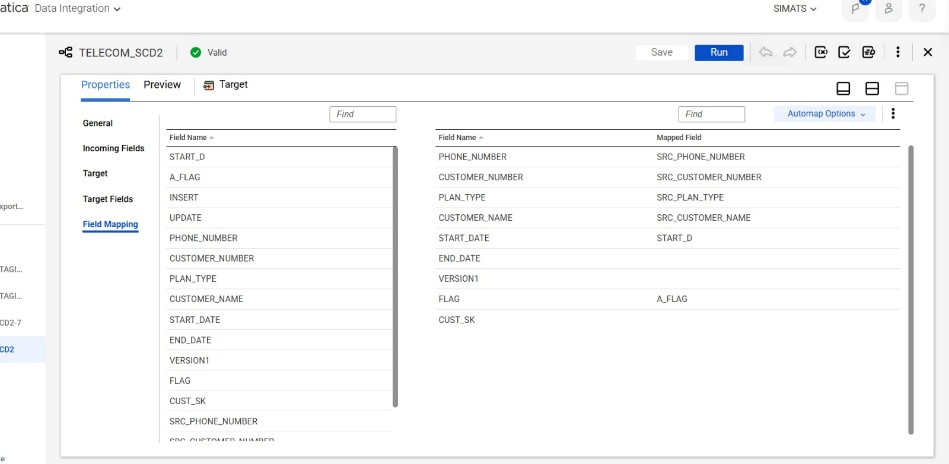

## 4) Cleansing

### What I implemented
- Cleaned datatype issues from raw source fields.
- Standardized call type and timestamp format.
- Converted revenue/duration to numeric.
- Derived international flag for downstream KPI logic.

### SQL
- `SQL_Scripts/01_cleansing_logic.sql`

### Images
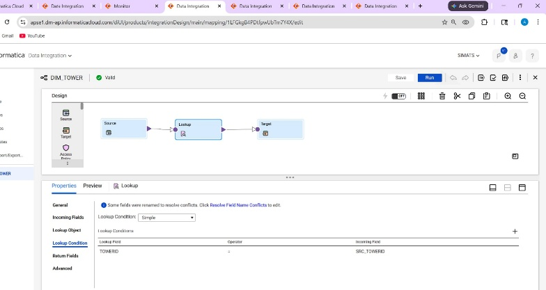
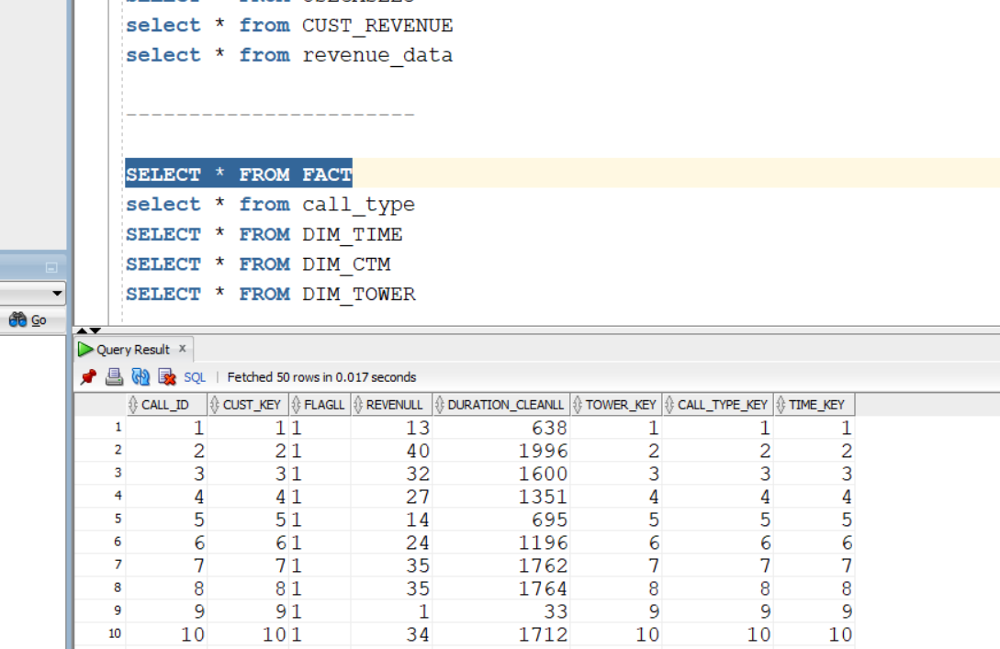

## 5) Dimension Tables

### What I implemented
- Built dimension structures for customer, time, tower, and call type.
- Added constraints and keys for integrity.
- Prepared dimensions for surrogate-key-based fact loading.

### SQL
- `SQL_Scripts/02_dimension_tables.sql`

### Images
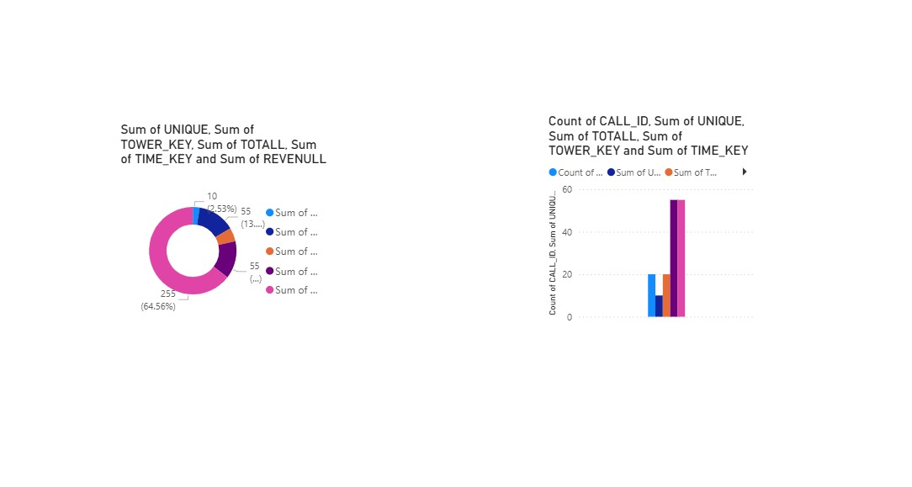


## 6) Fact Table

### What I implemented
- Created `FACT_CALL` with foreign keys to all dimensions.
- Added metrics (`DURATION_SECONDS`, `REVENUE_AMOUNT`, `CALL_COUNT`) and analysis flags.
- Built structure optimized for KPI aggregation.

### SQL
- `SQL_Scripts/03_fact_table_creation.sql`

### Images
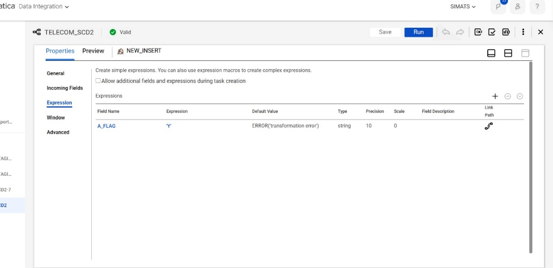
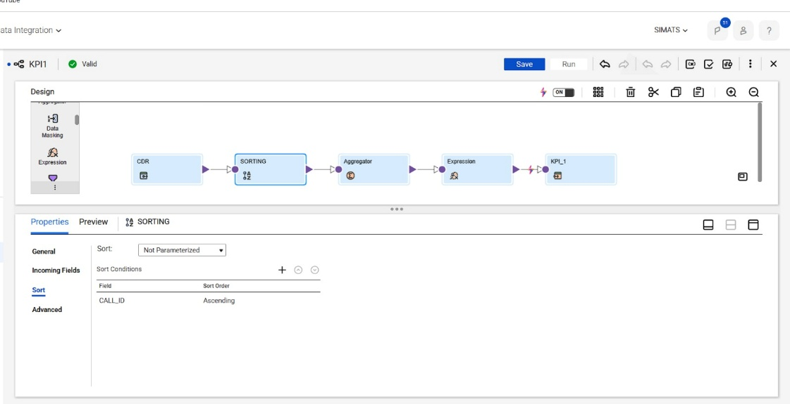

## 7) SCD Type 2 (Most Important)

### Why SCD Type 2 is critical
Telecom customer attributes (plan, segment, profile) change over time. SCD Type 2 preserves history by expiring old rows and inserting new versions, enabling accurate historical KPI analysis.

### What I implemented
- Current record identification with `IS_CURRENT = 'Y'`.
- Version boundaries using `EFFECTIVE_FROM_DT` and `EFFECTIVE_TO_DT`.
- Change detection and row version insertion logic.

### SQL
- `SQL_Scripts/02_scd2_dim_customer_logic.sql`

### Mapping images (Router + Expression + Insert/Update)

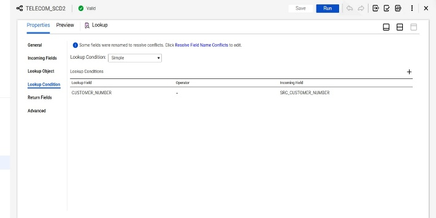

## 8) KPI Mapping and Results

### KPI set implemented
- KPI 1: Daily Call Volume Summary
- KPI 2: Call Type Performance Analysis
- KPI 3: International Call Monitoring
- KPI 4: Revenue Data

### SQL
- `SQL_Scripts/04_kpi_queries.sql`

### KPI images
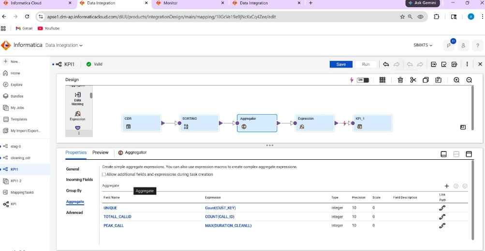
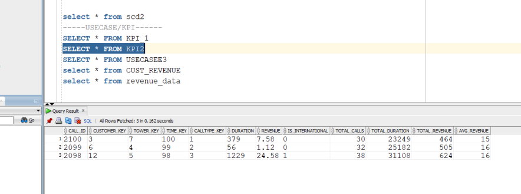

## 9) Final Reports / Dashboards

### Reporting outcome
- Visualized telecom usage and revenue trends.
- Highlighted international call behavior.
- Provided business-friendly chart outputs for stakeholders.

### Dashboard images
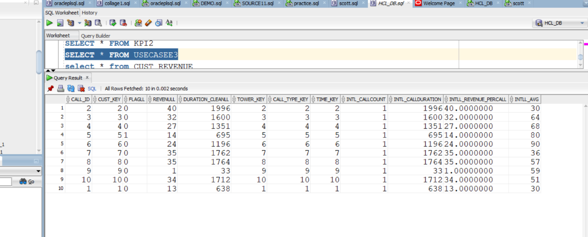
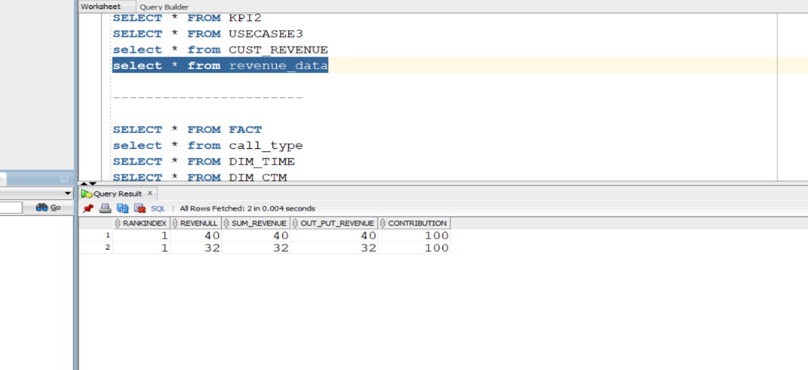

## SQL Execution Order

1. `SQL_Scripts/00_raw_and_staging_tables.sql`
2. `SQL_Scripts/01_cleansing_logic.sql`
3. `SQL_Scripts/02_dimension_tables.sql`
4. `SQL_Scripts/03_fact_table_creation.sql`
5. `SQL_Scripts/02_scd2_dim_customer_logic.sql`
6. `SQL_Scripts/04_kpi_queries.sql`

## How To Add Images In README

1. Keep images in the correct stage folder.
2. Use markdown format:

```md

```

3. Commit and push. GitHub automatically displays the images in the README page.
